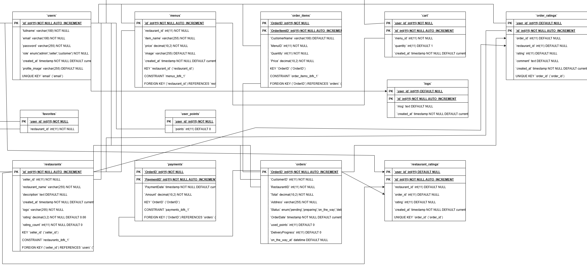
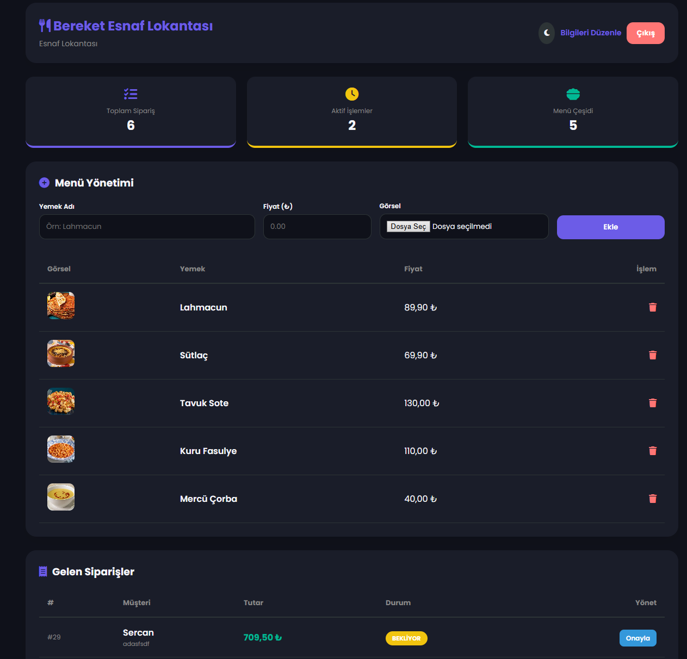
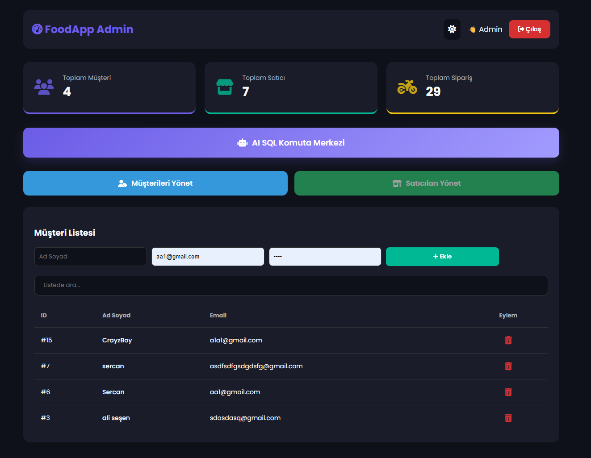
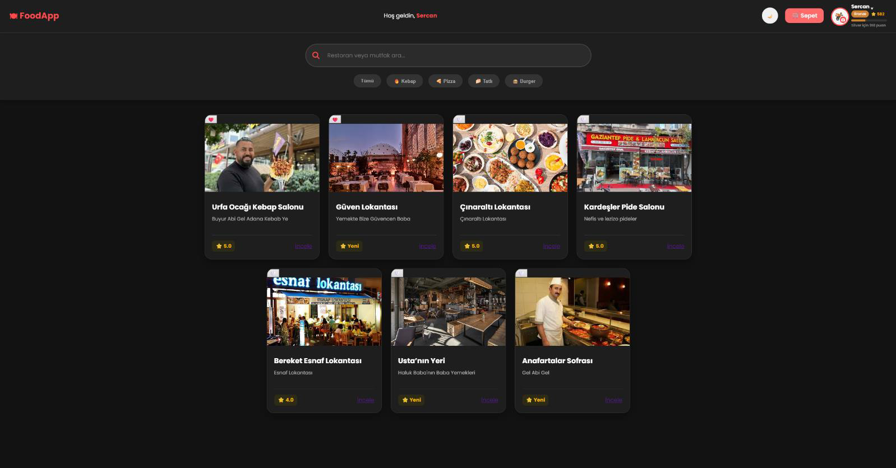
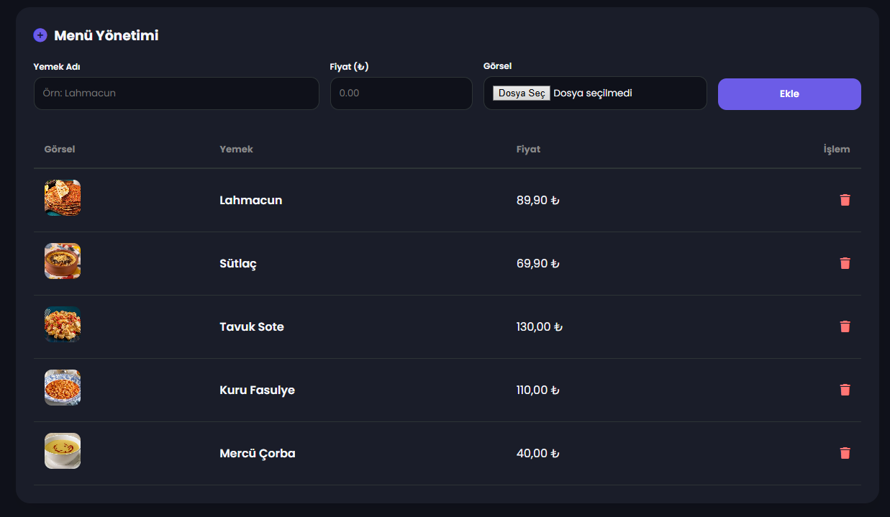
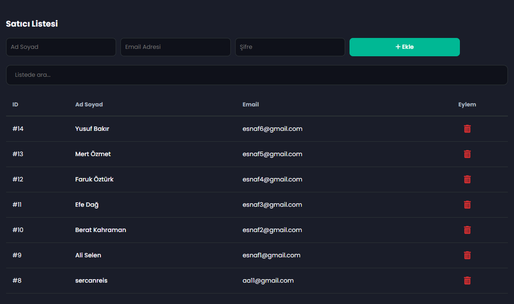
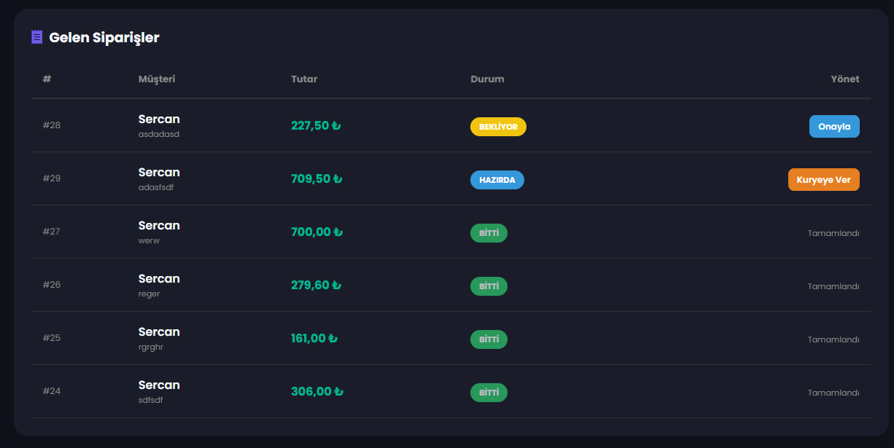
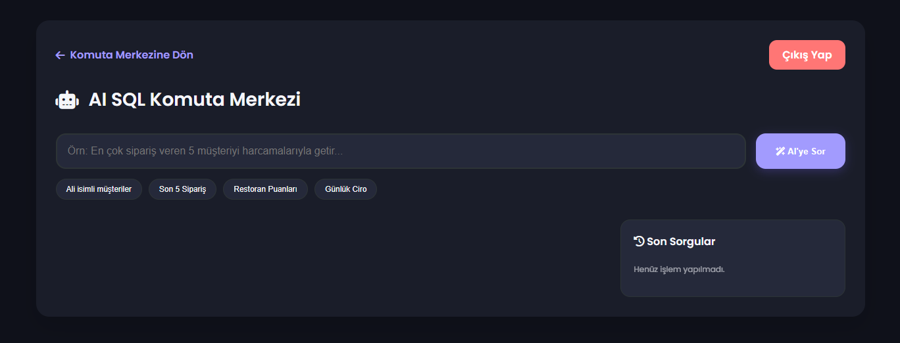

<h1 align="center">🍔 FoodApp</h1>

  <b>Role-based Food Ordering System</b> 
  PHP • MySQL • Admin / Seller / Customer Panels

  
  
  
  

---

## ✨ Features
- ✅ Register / Login / Logout
- 🧑‍💻 Admin Panel
- 🏪 Seller Panel (restaurant + menu management)
- 🛒 Customer Panel (cart, checkout, tracking)
- ❤️ Favorites system
- ⭐ Rating system

---

## 🧩 Panels
- **Admin:** `/admin`
- **Seller:** `/seller`
- **Customer:** `/customer`

---

## 🗄️ Database
SQL dump included:
- `database/foodapp.sql`

### Import (phpMyAdmin)
1. Create database: `foodapp`
2. Import file: `database/foodapp.sql`

---

## 🛠️ Local Setup (XAMPP)
1. Install **XAMPP**
2. Put the project folder into:
   - `xampp/htdocs/FoodApp`
3. Start **Apache** + **MySQL**
4. Import DB:
   - `database/foodapp.sql`
5. Configure DB connection:
   - `db.php`
6. Run:
   - `http://localhost/FoodApp/`

---

## 📸 Screenshots

  
  

  
  

  
  

  
  

---

## 👤 Author
**Sercan Özkan**
- Instagram: https://www.instagram.com/sercan.ozkn55/
- LinkedIn: https://www.linkedin.com/in/sercan-özkan-a205852a7/
